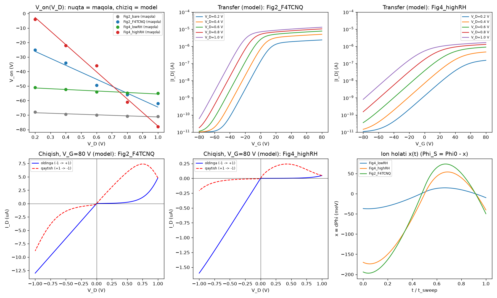

# MoS₂/F4TCNQ tranzistorida V_D ta'sirida V_on siljishi: maqola tahlili va COMSOL'da modellashtirish

**Maqola:** H. Kii, R. Nouchi, *"Drain-Induced Threshold-Voltage Shift Greater than 90 V/V in Molecule-Decorated MoS₂
Field-Effect Transistors Operated in Air"*, ACS Appl. Electron. Mater. **2025**, 7, 5282–5289.
DOI: 10.1021/acsaelm.5c00627 (+ Supporting Information, S1–S4 rasmlar)

Papkadagi fayllar:

| Fayl | Vazifasi |
|---|---|
| `MoS2_F4TCNQ_COMSOL_qollanma.md` | Ushbu qo'llanma: tahlil, COMSOL'da qilish mumkinligi, qadamma-qadam model |
| `mos2_f4tcnq/compact_model.py` | Kalibrlash modeli. Maqoladagi barcha asosiy raqamlarni takrorlaydi va COMSOL uchun parametrlarni beradi |
| `mos2_f4tcnq/extract_metrics.py` | COMSOL'dan eksport qilingan CSV'dan V_on, dV_on/dV_D, to'g'rilash va gisterezisni hisoblab, maqola bilan solishtiradi |
| `mos2_f4tcnq/compact_model_results.png` | Kalibrlash modelining grafiklari |

---

## 0. Qisqa javob

**Ha, COMSOL'da qilsa bo'ladi, lekin bitta muhim shart bilan.** Maqola **faqat eksperimental**. Unda model ham,
hisob ham yo'q. Bir nechta muhim kattalik umuman berilmagan: MoS₂ qalinligi, sweep tezligi, ushlab turish vaqti,
ionlar konsentratsiyasi, tuzoq (trap) zichligi. Shuning uchun COMSOL bu natijani "noldan bashorat" qilolmaydi.
Uni **kalibrlash** orqali olish kerak: noma'lum parametrlar maqola raqamlariga moslanadi.

Men buni tekshirdim. `compact_model.py` bitta fizik rasm bilan maqoladagi asosiy raqamlarning hammasini takrorlaydi
(7.1-bo'lim). Demak, COMSOL modeli ham xuddi shu raqamlarga chiqadi, agar unga to'g'ri fizika qo'yilsa.

Olinadigan natijalar (maqola → maqsad):

| Kattalik | Maqola | Kompakt model (tekshirilgan) |
|---|---|---|
| dV_on/dV_D, F4TCNQ (2b-rasm) | 46.3 V/V | 48.0 V/V (rasmdan olingan nuqtalar bo'yicha) |
| dV_on/dV_D, F4TCNQ, yuqori RH (4b) | **92.5 V/V** | 93.5 V/V |
| dV_on/dV_D, F4TCNQ, past RH (4b) | 5.3 V/V | 5.2 V/V |
| \|I(+1 V)\|/\|I(−1 V)\|, 2c / 4c yuqori RH / 4c past RH | 0.37 / 0.03 / 0.83 | 0.37 / 0.03 / 0.83 |
| −1 V dagi gisterezis, 2c / 4c yuqori RH / 4c past RH | 32% / 87% / 13% | 32% / 87% / 13% |

"Aynan o'zi" deganda real maqsad shu: **raqamlar 5–10% aniqlikda mos tushadi, egri chiziqlar shakli
o'xshash bo'ladi.** O'lchov shovqinini va har bir nuqtani nusxalash mumkin emas, bunga ehtiyoj ham yo'q.

Kerakli litsenziya: **Semiconductor Module** (majburiy). To'liq ion modeli (6-qism) uchun ion migratsiyasi
kerak bo'ladi. Buning uchun Chemical Reaction Engineering yoki elektrokimyo modullaridan biri kerak.
Ular bo'lmasa, Nernst–Planck tenglamasi bazaviy **Coefficient Form PDE** orqali qo'lda yoziladi.

---

## 1-qism. Maqolaning chuqur tahlili

### 1.1. Nima qilingan

- **Qurilma** (1-rasm): ko'p qatlamli MoS₂ (tabiiy kristalldan skotch bilan ajratilgan) 285 nm SiO₂ / kuchli
  legirlangan Si (gate) ustida. Kontaktlar Cr(1 nm)/Au, kanal uzunligi L = 5 µm, kengligi W = 11–18 µm.
  Ustidan TCNQ yoki F4TCNQ ning toluoldagi to'yingan eritmasi tomizilgan.
- **O'lchov:** Keysight B1500A, ochiq havoda, qorong'ida. Transfer (I_D–V_G) V_D = 0.2…1.0 V da.
  Chiqish (I_D–V_D) −1…+1 V oralig'ida, V_G = −80…+80 V.
- **V_on ta'rifi:** I_D = 1 nA bo'lgan V_G.

### 1.2. Asosiy natijalar

1. **Statik siljish.** F4TCNQ elektron akseptor. U MoS₂ dan elektron oladi (teshik legirlash), shuning uchun
   V_on musbat tomonga siljiydi. Bu ma'lum effekt.
2. **Dinamik siljish (asosiy yangilik).** F4TCNQ qo'yilgandan keyin V_on **V_D ga kuchli bog'liq** bo'lib qoladi:
   46.3 V/V, yuqori namlikda **92.5 V/V**. Taqqoslash uchun: Si da DIBL < 0.1 V/V, 2D FET larda ~0.1 V/V.
   Farq 2–3 tartib.
3. **To'g'rilash va memristiv gisterezis** chiqish xarakteristikasida. |I(+1)|/|I(−1)| = 0.37 (yuqori RH da 0.03).
   Oldinga va qaytish sweeplari orasidagi farq 32% (87%).
4. **Suv kerak.** Past namlikda (5.3 g/m³) effekt deyarli yo'qoladi: 5.3 V/V, to'g'rilash 0.83.
5. **Molekulaga bog'liq.** F4TCNQsiz: 3.1 V/V. TCNQ bilan: 5.3 V/V. Gate sweep gisterezisi (ΔV_on) F4TCNQ da
   eng katta. Mualliflar xulosasi: C–F dipollari suv molekulalarini kanal yonida ushlab turadi.
6. **Harakatchanlik kamayadi:** 34.3 → 6.9 cm²/Vs (F4TCNQ), namlik oshsa yana kamayadi (1.4 → 0.8).

### 1.3. Taklif qilingan mexanizm (7-rasm)

Suvdagi H₃O⁺ va OH⁻ ionlari V_D maydonida siljiydi. H₃O⁺ manbaga (source), OH⁻ drenajga to'planadi.
Elektrod sirtida qo'sh elektr qatlami (EDL) paydo bo'ladi va metallning **effektiv chiqish ishi** o'zgaradi:
- manbada WF kamayadi, demak **manba Schottky bareri pasayadi**, V_on manfiy tomonga siljiydi;
- drenajda WF oshadi, demak drenaj bareri ko'tariladi, asimmetriya paydo bo'ladi.

Ionlar **sekin** harakatlanadi. Shuning uchun bu asimmetriya V_D qutbi o'zgarganda darhol ag'darilmaydi.
Natijada to'g'rilash va memristiv gisterezis kuzatiladi.

Mualliflar boshqa ikki mexanizmni rad etadi:
(a) suv dipollarining tizilishi: kutilgan WF o'zgarishining ishorasi teskari chiqadi;
(b) suv elektrolizi: V_D < 1.23 V.

### 1.4. Mening hisob-kitoblarim (maqolada yo'q, COMSOL uchun muhim)

**(a) Barer qancha o'zgarishi kerak?** Schottky-barerli FET da subporog tok ∝ exp[(ψ − Φ_B)/kT], bunda
ψ = (V_G − V_FB)/m. Barer ΔΦ ga pasaysa, V_on ning siljishi **m·ΔΦ** bo'ladi. m ni subporog qiyaligidan
topish mumkin: SS = m·(kT/q)·ln10.

| Qurilma | SS (rasmdan, V/dek) | m | dV_on/dV_D | **β = ΔΦ_S/V_D** |
|---|---|---|---|---|
| F4TCNQ (2-rasm) | ~12 | ~200 | 48 V/V | **≈ 0.24 eV/V** |
| F4TCNQ, yuqori RH (4) | ~25 | ~420 | 93.5 V/V | **≈ 0.22 eV/V** |
| F4TCNQ, past RH (4) | ~7 | ~120 | 5.2 V/V | ≈ 0.04 eV/V |
| F4TCNQsiz (2) | ~5 | ~85 | 3.6 V/V | ≈ 0.04 eV/V |

Xulosa: "92 V/V" ning sirli joyi yo'q. Uni **ikki omil ko'paytmasi** beradi:
1. barerning o'rtacha o'zgarishi, V_D = 1 V da ~0.2 eV;
2. 285 nm oksid va juda katta interfeys tuzoqlari zichligi (SS = 10–30 V/dek) tufayli gate'ning kontaktga
   **juda kuchsiz** ta'siri (m ≈ 200–400).

**COMSOL uchun eng muhim oqibat:** modelda interfeys tuzoqlari (D_it ~ 10¹³ cm⁻²eV⁻¹) bo'lmasa,
m kichik bo'ladi va siljish bir necha voltdan oshmaydi. Tuzoqlar **majburiy**.

**(b) Suvning o'z ionlari yetarlimi?** Yo'q, va bu maqolaning zaif nuqtasi.
- ΔΦ ≈ 0.2 eV Helmholtz qatlamida (ε_r ≈ 6, d ≈ 0.3 nm, C_H ≈ 18 µF/cm²) σ ≈ 4 µC/cm² ≈ 2·10¹³ ion/cm²
  talab qiladi.
- Toza suvda [H₃O⁺] = 10⁻⁷ M ≈ 6·10¹⁹ m⁻³. 3 nm qalinlikdagi suv plyonkasidagi barcha ionlar butun 5 µm
  kanaldan bitta kontakt devoriga yig'ilsa ham, ~3·10¹⁰ cm⁻² chiqadi. Bu **~10³ marta kam**.
- Demak, ionlar boshqa manbadan kelishi kerak. Nomzodlar: erigan CO₂, sirt gidroksillari yoki
  **F4TCNQ⁻ anionlari va ularning qarshi ionlari**. Oxirgisi F4TCNQ nima uchun effektni kuchaytirishini
  maqoladagi dipol tushuntirishidan ham soddaroq izohlaydi. Maqolada bu variant ko'rib chiqilmagan.
- **Modelda:** ion konsentratsiyasi c₀ toza suv qiymatida emas, **kalibrlanadigan parametr** sifatida olinadi.

**(c) Ionlar tezligi.** Hajmiy suvda H₃O⁺ harakatchanligi µ ≈ 3.6·10⁻⁷ m²/(V·s). 5 µm ni 1 V da o'tish vaqti
L²/(µV) ≈ 70 µs. Kalibrlash esa τ ≈ 0.3 × (sweep vaqti) beradi. B1500A sweepi soniyalar davom etadi,
shuning uchun τ ~ soniyalar. Demak, **sirtdagi ionlarning effektiv harakatchanligi hajmiy suvdagidan
10⁴–10⁵ marta kichik** (adsorbsiyalangan, bog'langan suv). COMSOL'da D_eff ham kalibrlanadi.

**(d) To'g'rilash tarixdan keladi.** Qarorlashgan (stationary) holatda mexanizm simmetrik: +V_D da manba
bareri pasayadi, −V_D da drenaj bareri pasayadi. To'g'rilash faqat ionlar sekinligi va sweep **−1 V dan
boshlanishi** tufayli paydo bo'ladi. 2c-rasmdagi ①→②→③→④ strelkalari: −1→0→+1→0→−1. Shuning uchun
**COMSOL'da to'g'rilash va gisterezisni faqat Time Dependent studiya beradi. Stationary studiya ularni bermaydi.**

### 1.5. Tanqidiy baholash

| Kuchli tomonlari | Zaif tomonlari / noaniqliklar |
|---|---|
| Effekt juda katta va aniq ko'rinadi | Har bir holat uchun **bitta qurilma**, statistika yo'q |
| Namlik bilan nazorat tajribasi bor (bitta qurilmada) | 2-rasm uchun namlik ko'rsatilmagan |
| TCNQ va molekulasiz nazorat qurilmalari bor | Sweep tezligi, ushlab turish vaqti, MoS₂ qalinligi berilmagan |
| DIBL va elektroliz asosli rad etilgan | Mexanizm faqat taklif. KPFM yoki impedans bilan tasdiqlanmagan |
| Namlik sensori uchun amaliy g'oya | Ionlar soni yetishmasligi (1.4b) muhokama qilinmagan |
| | µ kontakt cheklagan tokdan olingan, shuning uchun kanalning haqiqiy µ si emas |
| | V_on = V_G(1 nA) W ga va off-tokka bog'liq; 6-rasmda mezon 2 nA ga o'zgartirilgan |

---

## 2-qism. COMSOL'da nima qilsa bo'ladi, nima qilib bo'lmaydi

| Hodisa | COMSOL'da | Qanday |
|---|---|---|
| MoS₂ kanali, drift-diffuziya, gate | ✅ to'g'ridan-to'g'ri | Semiconductor → Thin Insulator Gate |
| Schottky kontaktlar (Au/MoS₂) | ✅ | Metal Contact → Schottky, termoemissiya |
| Katta SS va tuzoqlar (m ≈ 200–400) | ✅ | Interfeys tuzoqlari (Trapping) |
| Barerning V_D ga sekin bog'liqligi (fenomenologik) | ✅ | Global ODE: dx/dt = (β·V_D − x)/τ → Φ_B,S = Φ₀ − x, Φ_B,D = Φ₀ + x |
| Ion transporti (Nernst–Planck) + Poisson | ✅ | Transport of Diluted Species (migratsiya bilan) yoki Coefficient Form PDE |
| Ion zaryadi → chiqish ishi o'zgarishi | ⚠️ qo'lda | ΔΦ = σ_ion/C_H, integratsiya operatori orqali |
| Barer orqali tunnellash (TFE) | ⚠️ versiyaga bog'liq | Yo'q bo'lsa, effektiv barer bilan |
| F4TCNQ–suv dipol o'zaro ta'siri, zaryad ko'chishi | ❌ | Bu kimyo/DFT masalasi. COMSOL'ga parametr sifatida kiradi (σ_F4, c₀, D) |
| V_on siljishi, to'g'rilash, gisterezis raqamlari | ✅ kalibrlash orqali | 7-qism |

**Strategiya:** ikki bosqich.
- **A modeli (gibrid, tavsiya etiladi, 5-qism).** Semiconductor + Global ODE. Barcha asosiy raqamlarni beradi,
  tez va turg'un yaqinlashadi.
- **B modeli (to'liq fizik, 6-qism).** Unga suv qatlami va ion transporti qo'shiladi. Bu "nima uchun" degan
  savolga javob beradi: c₀ va D qanday bo'lishi kerak.

---

## 3-qism. Avval kalibrlash (Python, 5 daqiqa)

```bash
cd mos2_f4tcnq
pip install numpy scipy matplotlib
python3 compact_model.py
```

Skript maqola rasmlaridan olingan nuqtalarni ishlatadi. U β, m, V₀₀, τ, I_c0 larni topadi va natijani
`compact_model_results.png` ga chizadi. **Shu parametrlar 5-qismdagi COMSOL modeliga boshlang'ich qiymat bo'ladi.**
Kalibrlash natijalari (t_hold = 0.5·t_sweep deb qabul qilingan):

| Qurilma | β, eV/V | τ / t_sweep |
|---|---|---|
| F4TCNQ (2-rasm) | 0.24 | 0.30 |
| F4TCNQ, yuqori RH | 0.22 | 0.35 |
| F4TCNQ, past RH | 0.04 | 0.28 |

Uchala F4TCNQ holatida τ deyarli bir xil (~0.3). Demak, namlik ionlar **tezligini** emas, **miqdorini**
(β ni) o'zgartiradi. Bu maqolada yo'q, lekin mexanizmga mos keladigan foydali xulosa.

> Aniqroq natija kerak bo'lsa, rasmlarni WebPlotDigitizer bilan raqamlashtiring va `compact_model.py`dagi
> `DATA` lug'atini yangilang. Hozirgi nuqtalar ko'z bilan ±1–2 V aniqlikda olingan.

---

## 4-qism. Parametrlar jadvali (COMSOL Global Definitions → Parameters)

| Nomi | Qiymat | Izoh |
|---|---|---|
| `L_ch` | 5[um] | maqola |
| `L_c` | 1[um] | kontakt ostidagi MoS₂ uzunligi (taxmin) |
| `t_mos` | 10[nm] | **berilmagan.** Ko'p qatlamli, 5–20 nm oralig'ida sinab ko'ring |
| `t_ox` | 285[nm] | maqola, C_ox = 12.1 nF/cm² |
| `W_dev` | 12.8[um] | 4-rasm qurilmasi (2-rasm uchun 11.9 um). 2D modelda "Out-of-plane thickness" |
| `T0` | 300[K] | |
| `VG`, `VD` | 0[V] | sweep qilinadi |
| `Eg_mos` | 1.23[V] | ko'p qatlamli MoS₂ (bilvosita zona) |
| `chi_mos` | 4.0[V] | elektron yaqinligi, 3.9–4.2 |
| `eps_mos` | 7 | ko'ndalang ε. Anizotrop variant: ε_xx = 14, ε_yy = 6.5 |
| `Nc_mos`, `Nv_mos` | 1e19[1/cm^3] | taxminiy |
| `Nd_mos` | 1e17[1/cm^3] | tabiiy n-tip. "Normally-on" bo'lishi uchun moslanadi |
| `mu_n` | 30[cm^2/(V*s)] | F4TCNQsiz. F4TCNQ bilan 2–7, yuqori RH da ~0.3–1 (kalibrlash) |
| `Phi_B0` | 0.25[V] | Au/MoS₂ effektiv bareri (Fermi pinning). **V_on(V_D→0) ga moslanadi** |
| `Dit` | 3e13[1/(cm^2*eV)] | **SS ga moslanadi**: SS ≈ 0.06·(1 + q·D_it/C_ox) V/dek |
| `sigma_F4` | -1e12[1/cm^2]*e_const | F4TCNQ statik zaryadi (statik siljish) |
| `beta` | 0.22[V/V] | 3-qismdan (yuqori RH) |
| `tau_ion` | 0.35*t_sw | 3-qismdan |
| `t_sw` | 40[s] | bitta chiqish sweepi davomiyligi (taxmin) |
| `t_hold` | 0.5*t_sw | −1 V da ushlab turish |

---

## 5-qism. A modeli: Semiconductor + Global ODE (qadamma-qadam)

### 5.1. Model Wizard
2D → **Semiconductor (semi)** + **Mathematics → Global ODEs and DAEs (ge)** → Study: *Semiconductor Equilibrium*
(keyin Stationary va Time Dependent qo'shiladi).

### 5.2. Geometriya (birlik: nm yoki µm)
Oksid alohida domen qilib chizilmaydi. Uni **Thin Insulator Gate** chegara sharti modellaydi. Bu 285 nm / 10 nm
nisbatdagi to'r muammosini butunlay yo'qotadi.
- To'rtburchak MoS₂: kengligi `L_ch + 2*L_c`, balandligi `t_mos`, pastki chap burchagi (−L_c, 0).
- Yuqori chegarani **Point** lar bilan x = 0 va x = L_ch nuqtalarida bo'ling. Natijada uch segment bo'ladi:
  manba kontakti [−L_c, 0], ochiq kanal sirti [0, L_ch], drenaj kontakti [L_ch, L_ch + L_c].
- Component → Geometry → "Out-of-plane thickness" (semi ichida) = `W_dev`. Shunda tok amperda chiqadi va
  1 nA mezoni to'g'ri ishlaydi.

### 5.3. Material (Semiconductor Material Model)
`Eg_mos`, `chi_mos`, `eps_mos`, `Nc_mos`, `Nv_mos`, `mu_n`, µ_p = 10 cm²/Vs.
**Analytic Doping Model:** donor, `Nd_mos`, bir jinsli.

### 5.4. Fizika (Semiconductor)
1. **Formulation:** Finite volume (tavsiya) yoki FE log formulation. **Carrier statistics:** Maxwell–Boltzmann.
2. **Metal Contact 1 (source)**, yuqori chap segment: Terminal type Voltage, V = 0.
   Contact type **Schottky**, barer balandligi *User defined*: `Phi_B0 - x`.
   (Versiyaga qarab: yo metall chiqish ishini `chi_mos + Phi_B0 - x` qilib berasiz, yo barer balandligini
   to'g'ridan-to'g'ri berasiz.) Current: *Thermionic*. Versiyangizda Schottky kontakt uchun tunnellash opsiyasi
   bo'lsa, uni ham yoqib sinab ko'ring.
3. **Metal Contact 2 (drain)**, yuqori o'ng segment: V = `VD` (Time Dependent'da `VDt(t)`), barer `Phi_B0 + x`.
4. **Thin Insulator Gate**, pastki chegara (butun uzunlik): ε_r = 3.9, qalinlik `t_ox`, V = `VG`.
   Uning ostiga **Trapping** qo'shing (interfeys tuzoqlari): uzluksiz taqsimot, zona ichida bir tekis, zichlik `Dit`,
   donor+akseptor yoki neytrallik darajasi o'rtada. Sub-tugun nomi versiyaga qarab farq qiladi:
   Traps / Interface Trapping.
5. **Surface Charge Density**, ochiq kanal sirti [0, L_ch]: `sigma_F4`. Bu F4TCNQ ning statik siljishi.
   Bu sirt qolgan joylarda izolyatsiya (Zero Charge).

### 5.5. Global ODE (ionlar holati)
Global Equations: nomi `x`, birligi V.

```
f(u,ut,utt,t) = xt - (beta*VD_eff - x)/tau_ion        initial value: x0
```
- Stationary (transfer) uchun: **ODE'ni o'chiring** va Definitions → Variables'da `x = beta*VD` deb yozing.
  Transfer sweep paytida V_D uzoq vaqt o'zgarmaydi, shuning uchun ionlar muvozanatda bo'ladi.
- Time Dependent (chiqish) uchun: ODE yoqiladi, `VD_eff = VDt(t)`, `x0 = 0`.

### 5.6. V_D(t) signali (chiqish xarakteristikasi uchun)
Definitions → Functions → **Piecewise** (yoki Interpolation) `VDt(t)`:

| t oralig'i | VDt |
|---|---|
| 0 … t_hold | −1 |
| t_hold … t_hold + t_sw/2 | −1 + 4·(t − t_hold)/t_sw |
| t_hold + t_sw/2 … t_hold + t_sw | 1 − 4·(t − t_hold − t_sw/2)/t_sw |

Ya'ni −1 V da ushlab turish, keyin −1 → +1 → −1. Bu maqoladagi ①②③④ tartibi.

### 5.7. To'r
MoS₂ qalinligi bo'yicha kamida 10–20 element. Kontakt qirralarida (x = 0, x = L_ch) zichlashtiring:
Distribution + element ratio, qirra atrofida 1–5 nm. Mapped mesh ishlatish qulay.

### 5.8. Studiyalar
**Study 1: Transfer (V_on(V_D) va 2a/4a rasmlar)**
1. *Semiconductor Equilibrium* (VG = 0, VD = 0).
2. *Stationary* + **Parametric Sweep**: `VD` = 0.2 0.4 0.6 0.8 1.0.
   **Auxiliary sweep:** `VG` = range(80, −1, −80), continuation yoqilgan. Yuqoridan pastga sweep qiling,
   on-holatdan boshlash yaqinlashishni osonlashtiradi.
3. Natija: Global Evaluation `semi.I0_2` (drenaj toki), eksport: VD, VG, ID ustunlari → `transfer.csv`.

**Study 2: Chiqish (to'g'rilash va gisterezis, 2c/4c rasmlar)**
1. *Stationary*: VG = 80 V, VD = −1 V, x = −beta·(1 − exp(−t_hold/tau_ion)) boshlang'ich holat uchun.
   Yoki t = 0 dan boshlab butun ushlab turish vaqtini hisoblang.
2. *Time Dependent*: `range(0, t_sw/200, t_hold + t_sw)`, oldingi yechimdan boshlanadi. Global ODE yoqilgan.
3. Eksport: t, VDt(t), semi.I0_2 → `output.csv`.

### 5.9. Solishtirish
```bash
python3 mos2_f4tcnq/extract_metrics.py transfer transfer.csv --device Fig4_highRH
python3 mos2_f4tcnq/extract_metrics.py output   output.csv   --device Fig4_highRH
```
Skript maqoladagi qiymatlarni yonma-yon chiqaradi.

### 5.10. Kalibrlash tartibi (qaysi parametr nimani boshqaradi)

| Qadam | Moslanadigan parametr | Maqsad (maqoladan) |
|---|---|---|
| 1 | `Dit` | subporog qiyalik: 2a da ~12 V/dek, 4a yuqori RH da ~25 V/dek |
| 2 | `Phi_B0`, `sigma_F4`, `Nd_mos` | V_on(V_D = 0.2 V): −25 V (2b), −4 V (4b yuqori RH) |
| 3 | `beta` | dV_on/dV_D = 46.3 / 92.5 / 5.3 V/V |
| 4 | `mu_n` | on-tok: V_G = 80 V, V_D = −1 V da 13 µA (2c), 1.6 µA (4c yuqori RH) |
| 5 | `tau_ion`, `t_hold` | to'g'rilash 0.37 / 0.03 va gisterezis 32% / 87% |

Har bir qadamda **faqat bitta** parametrni o'zgartiring (Parametric Sweep), qolganini qotiring.

---

## 6-qism. B modeli: suv qatlami va haqiqiy ion transporti (ixtiyoriy, ilmiy qism)

A modelidagi x ni endi hisoblab chiqaramiz.

1. **Geometriya:** MoS₂ ustiga, kontaktlar orasiga va kontakt devorlari bo'ylab `t_w` = 2–5 nm qalinlikdagi
   "suv" domeni qo'shiladi. Au kontaktlarni endi to'rtburchak qilib chizing (balandligi ~50 nm), shunda suv
   ularning yon devoriga tegadi.
2. **Elektrostatika:** semi interfeysida suv domeni izolyator sifatida (Charge Conservation) qo'shiladi,
   ε_r = 10–20 (adsorbsiyalangan suv hajmiy 80 dan past). **Space Charge Density:**
   `F_const*(c_p - c_n)`.
3. **Ionlar**, faqat suv domenida, ikki tur: H₃O⁺ (z = +1), OH⁻ (z = −1).
   - Transport of Diluted Species, *Migration in electric field* yoqilgan, potensial = semi dagi `V`.
   - Yoki **Coefficient Form PDE** (bazaviy litsenziya), har bir ion uchun:
     `da = 1`, `c = D`, `α = (z*D*F_const/(R_const*T0))*(Vx, Vy)`, `f = 0`.
     Bu Nernst–Planck oqimini beradi: N = −D∇c − z·(D/RT)·F·c·∇V.
   - Chegaralar: hamma joyda oqim nol. Elektrodlar bloklovchi, reaksiya yo'q, chunki V_D < 1.23 V.
   - Boshlang'ich: c_p = c_n = `c0`.
   - **`c0` va `D` kalibrlanadi.** 1.4-bo'limga ko'ra c0 ≫ 10⁻⁴ mol/m³ (toza suv) va D ≪ 10⁻⁸ m²/s bo'ladi.
     Boshlang'ich taxmin: c0 ~ 0.1–10 mol/m³, D ~ 10⁻¹⁴–10⁻¹³ m²/s. Shunda τ soniyalar tartibida chiqadi.
4. **Barerga bog'lash** (maqoladagi mexanizm): Definitions → Integration operator `intS` manba devori yonidagi
   yupqa suv polosasi ustida (masalan, devordan 5 nm gacha), `intD` drenaj yonida.
   ```
   sigS = F_const*intS(c_p - c_n)/h_wall       // manba yonidagi sirt zaryadi, C/m^2
   dPhiS = sigS/C_H                            // C_H = eps0*eps_H/d_H, eps_H ~ 6, d_H ~ 0.3 nm
   Phi_BS = Phi_B0 - dPhiS
   ```
   Drenaj uchun ham xuddi shunday. A modelidagi `x` o'rniga shu ifodalar qo'yiladi.
5. **Tekshirish:** B modeli A modeldagi β va τ ni bersa, maqoladagi mexanizm miqdoriy jihatdan ham to'g'ri
   bo'ladi. Buning uchun zarur c0 va D qiymatlari esa maqolada yo'q bo'lgan yangi natija.
6. **Tezlashtirish:** avval faqat ion + Poisson qismini alohida hisoblang (semi o'chirilgan, MoS₂ dielektrik
   sifatida). x(t) ni oling, keyin A modeliga qo'ying (segregated yondashuv).

---

## 7-qism. Kutiladigan natijalar va tekshiruv

### 7.1. Kompakt model natijalari (tekshirilgan)

`python3 mos2_f4tcnq/compact_model.py` natijasi:

```
qurilma         slope,V/V   maqola   V00,V      m  beta,eV/V
Fig2_bare            -3.6      nan   -67.7     84      0.043
Fig2_F4TCNQ         -48.0     46.3   -16.5    202      0.238
Fig4_lowRH           -5.2      5.3   -50.3    118      0.044
Fig4_highRH         -93.5     92.5    15.9    420      0.223

qurilma          Ic0,uA mu_ch  tau/t_sw | |I(-1)|,uA  maq. | I(+1)/I(-1)  maq. |  gist.  maq.
Fig2_bare         25.66  14.4     0.030 |      48.00  48.0 |        0.93  1.00 |     7%    7%
Fig2_F4TCNQ        4.04   2.5     0.298 |      13.00  13.0 |        0.37  0.37 |    32%   32%
Fig4_lowRH        28.26   1.9     0.283 |       9.50   9.5 |        0.83  0.83 |    13%   13%
Fig4_highRH        0.06   0.3     0.349 |       1.60   1.6 |        0.03  0.03 |    87%   87%
```



### 7.2. Kompakt modelning ma'lum kamchiligi
Qaytish sweepida musbat V_D da (③ strelka) model tokni maqoladagidan kattaroq ko'rsatadi. Sababi: modelda
barer va ionlar holati o'rtasidagi bog'liqlik chiziqli va simmetrik. Ehtimol, haqiqatda H₃O⁺ va OH⁻ ning
tezligi har xil, EDL esa to'yinadi. B modeli buni o'z-o'zidan hisobga oladi. A modelida esa β ni
x ga bog'liq qilib (masalan, `beta*tanh(...)`) yoki H₃O⁺/OH⁻ uchun alohida τ bilan tuzatish mumkin.

### 7.3. Tez-tez uchraydigan muammolar
- **Yaqinlashmaydi, V_G = −80 V:** VG ni +80 dan pastga sweep qiling, qadamni 1 V gacha kamaytiring,
  Finite Volume formulyatsiyasini ishlating. I_D ~ 10⁻¹² A da tokni aniq hisoblash uchun
  Relative tolerance = 1e-6.
- **Siljish juda kichik (bir necha V):** `Dit` yo'q yoki juda kichik (1.4a-bo'lim).
- **To'g'rilash yo'q:** Stationary studiyada hisoblayapsiz. Time Dependent kerak, −1 V dan boshlanishi va
  ushlab turish bilan (1.4d).
- **Tok W ga mos kelmayapti:** 2D modelda out-of-plane thickness = W_dev qo'yilmagan.

---

## 8-qism. Xulosa

1. Maqola **kuchli, lekin faqat eksperimental**. Mexanizm (ionlar → EDL → Schottky bareri) ishonarli,
   biroq miqdoriy asoslanmagan. Toza suvning ionlari ~10³ marta yetmaydi va ionlar hajmiy suvdagidan
   10⁴–10⁵ marta sekin bo'lishi kerak.
2. "92.5 V/V" ni **~0.2 eV/V barer modulyatsiyasi × katta m (285 nm SiO₂ + D_it ~10¹³)** beradi.
   COMSOL'da tuzoqlarsiz bu natijani olib bo'lmaydi.
3. **COMSOL'da qilsa bo'ladi.** Semiconductor Module + Global ODE (A modeli) maqoladagi barcha asosiy
   raqamlarni kalibrlash orqali beradi. Men buni kompakt modelda tekshirdim: 4 qurilma, 3 xil ko'rsatkich.
   B modeli (ion transporti) mexanizmning o'zini tekshiradi va maqolada yo'q yangi natija beradi.
4. Egri chiziqlarni "nuqtama-nuqta" olish uchun maqolada yo'q parametrlar kerak: t_mos, sweep tezligi,
   ushlab turish vaqti, D_it. Ular kalibrlanadi. Bu kalibrlangan modelning chegarasi ekanini ishda
   ochiq yozish kerak.
