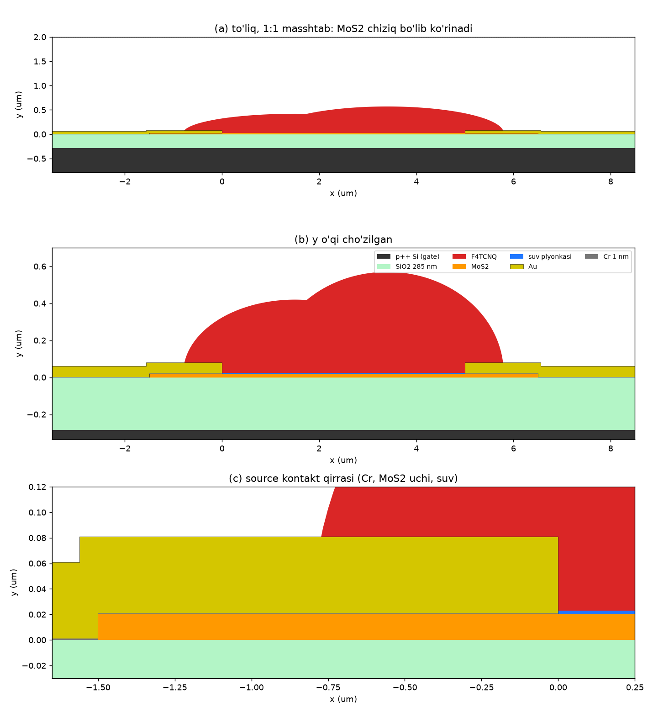

# Geometriya: maqoladagi qurilma (1a-rasm) bilan bir xil 2D kesim

`geometry_preview.png` rasmini `python geometry_preview.py` chizadi. COMSOL'da qurilgan geometriya shu rasm
bilan bir xil bo'lishi kerak.

## 1. "Faqat to'g'ri chiziq ko'rinyapti": sababi

MoS₂ qatlami ~20 nm, qurilma esa ~12 µm uzunlikda. Nisbat 1:600. COMSOL 2D oynada o'qlarni sukut bo'yicha
teng masshtabda ko'rsatadi, shuning uchun MoS₂, Cr va Au chiziq bo'lib ko'rinadi (rasmdagi (a) panel).
Faqat MoS₂ chizilgan bo'lsa (kechagi "A modeli", oksidsiz), butun geometriya bitta chiziqqa o'xshaydi.
Bu xato emas.

Ko'rish uchun: **Definitions → View 1 → Axis → "Preserve aspect ratio" belgisini olib tashlang**. Yoki
Graphics'da "Zoom Box" bilan kontakt qirrasini kattalashtiring.

Kechagi fayl oxiriga yetmagan bo'lishi ham mumkin. Buni `STATUS.md` va loglar ko'rsatadi.
Davom ettirish prompti avval shuni tekshiradi.

## 2. Maqoladan olingan va olinmagan o'lchamlar

| Element | Maqolada | Modelda | Asos |
|---|---|---|---|
| Gate | kuchli legirlangan Si | p++ Si, qalinligi `t_Si` = 0.5 µm (chiziladi, ekvipotensial) | 1a-rasm, 2-bet |
| Gate dielektrigi | SiO₂ **285 nm** | `t_ox` = 285 nm, ε = 3.9 | maqola; C_ox = 12.1 nF/cm² |
| Kanal | ko'p qatlamli MoS₂ | `t_mos` = 20 nm | **berilmagan.** Optik rangi och, demak qalin (10–50 nm). Sweep qilinadi |
| Kanal uzunligi | **L = 5 µm** | `L_ch` = 5 µm (kontaktlar orasidagi masofa) | maqola |
| Kanal kengligi | **W = 12.8 µm** (4-rasm), 11.9 µm (2-rasm) | 2D "out-of-plane thickness" | maqola |
| Adgeziya qatlami | **Cr 1 nm** | `c` = 1 nm, Au ostida, MoS₂ ustida va uchida, SiO₂ ustida | maqola, 1a-rasm |
| Kontakt | Au | `t_Au` = 60 nm, pog'onali (MoS₂ uchidan SiO₂ ga tushadi) | qalinligi **berilmagan**. 1a-rasmdagi shakl |
| Kontakt MoS₂ ustida | — | `L_ov` = 1.5 µm | berilmagan. 1c-rasmdagi elektrod eni ~1.5–2 µm |
| Kontakt SiO₂ ustida | — | `L_pad` = 2 µm | modelning yon chegarasi |
| F4TCNQ | toluoldan tomizilgan, gumbazsimon | ikki ellips-gumbaz, balandligi 0.40 va 0.55 µm, kanalni to'ldiradi va Au ustiga chiqadi | qalinligi **berilmagan**. 1a-rasmdagi shakl |
| Adsorbsiyalangan suv | mexanizmda bor (7-rasm) | `t_w` = 3 nm plyonka, MoS₂ va F4TCNQ orasida, Cr/Au ning ichki devoriga tegadi | taxmin |
| Havo | ochiq havoda o'lchangan | havo domeni, y = 2 µm gacha | |

Eslatma: 1c-mikrofotoda bitta MoS₂ bo'lagi ustida bir nechta parallel Au chiziq bor. O'lchov ikki qo'shni
elektrod orasida olingan. 1a-rasm sxematik, lekin foydalanuvchi talabi bo'yicha model aynan 1a-rasmni takrorlaydi.

## 3. Koordinatalar (µm, y = 0 — SiO₂ ning ustki sirti)

Parametrlar: `L=5, L_ov=1.5, L_pad=2, t_mos=0.020, c=0.001, t_Au=0.060, t_ox=0.285, t_Si=0.5, t_w=0.003, H_air=2`.
`xS0 = -L_ov - L_pad = -3.5`, `xD1 = L - xS0 = 8.5`.

| Domen | Primitiv (COMSOL) | Koordinatalar |
|---|---|---|
| Si (gate) | Rectangle | x ∈ [xS0, xD1], y ∈ [−t_ox − t_Si, −t_ox] |
| SiO₂ | Rectangle | x ∈ [xS0, xD1], y ∈ [−t_ox, 0] |
| MoS₂ | Rectangle | x ∈ [−L_ov, L + L_ov], y ∈ [0, t_mos] |
| Cr (source) | Polygon | (xS0,0) (−L_ov,0) (−L_ov,t_mos) (0,t_mos) (0,t_mos+c) (−L_ov−c,t_mos+c) (−L_ov−c,c) (xS0,c) |
| Au (source) | Polygon | (xS0,c) (−L_ov−c,c) (−L_ov−c,t_mos+c) (0,t_mos+c) (0,t_mos+c+t_Au) (−L_ov−c−t_Au,t_mos+c+t_Au) (−L_ov−c−t_Au,c+t_Au) (xS0,c+t_Au) |
| Cr, Au (drain) | Mirror, x = L/2 o'qiga nisbatan | source'ning ko'zgu aksi |
| Suv plyonkasi | Rectangle | x ∈ [0, L], y ∈ [t_mos, t_mos + t_w] |
| F4TCNQ | (Ellipse1 ∪ Ellipse2) ∩ {y ≥ t_mos} − (Au, Cr, suv, MoS₂) | E1: markaz (0.30·L, t_mos), yarim o'qlar (0.30·L+0.8, 0.40); E2: markaz (0.68·L, t_mos), yarim o'qlar (0.32·L+0.8, 0.55) |
| Havo | Rectangle − qolganlari | x ∈ [xS0, xD1], y ∈ [0, H_air] |

Yakunda **Form Union**. Barcha o'lchamlar parametr orqali berilsin (`t_mos` ni sweep qilish uchun).

## 4. Domenlar va fizika

| Domen | Semiconductor (semi) | Parametr |
|---|---|---|
| MoS₂ | Semiconductor Material Model | qo'llanmaning 4-qismi |
| SiO₂ | Charge Conservation (izolyator) | ε = 3.9 |
| F4TCNQ | Charge Conservation | ε ≈ 3 (taxmin) |
| Suv | Charge Conservation (A modeli); B modelida + ionlar | ε ≈ 20 (adsorbsiyalangan suv) |
| Havo | Charge Conservation | ε = 1 |
| Si, Cr, Au | **semi'ga kirmaydi** (metallar) | ularning chegaralari kontakt shartlari bo'ladi |

| Chegara | Shart |
|---|---|
| MoS₂ ↔ Cr (source: MoS₂ ustki sirti x ∈ [−L_ov, 0] va MoS₂ uchi x = −L_ov) | Metal Contact, Schottky, V = 0, barer `Phi_B0 - x` |
| MoS₂ ↔ Cr (drain, ko'zgu aksi) | Metal Contact, Schottky, V = VD, barer `Phi_B0 + x` |
| Izolyatorlar ↔ source Cr/Au | Gate Contact (yoki 6.0 dagi ekvivalenti), V = 0 |
| Izolyatorlar ↔ drain Cr/Au | xuddi shunday, V = VD |
| SiO₂ ↔ Si | Gate Contact, V = VG (p++ Si chiqish ishi bilan) |
| MoS₂ ↔ SiO₂ | ichki chegara, interfeys tuzoqlari **D_it** (Trapping) |
| MoS₂ ↔ suv/F4TCNQ | F4TCNQ statik zaryadi `sigma_F4` (sirt zaryadi) |
| Tashqi chegaralar | Zero Charge |

Aniq feature nomlari (Gate Contact, Insulator Interface/Trapping) COMSOL 6.0 Application Library'dagi
namunaviy modellardan olinsin (PROMPT.md, B1).

## 5. To'r

- MoS₂: qalinligi bo'yicha ≥ 10 element (mapped yoki boundary layer). Kontakt qirralarida (x = 0, x = L,
  x = −L_ov, x = L + L_ov) 2–5 nm gacha zichlashtirilsin.
- Cr (1 nm): mapped, qalinligi bo'yicha 1–2 element. U semi'da yechilmaydi, lekin geometriyada bor.
- Suv (3 nm): qalinligi bo'yicha ≥ 3 element.
- SiO₂, F4TCNQ, havo: erkin uchburchak, o'sish koeffitsiyenti 1.2–1.3.
- Tekshiruv: to'r statistikasi (elementlar soni, minimal sifat) `STATUS.md` ga yozilsin.
